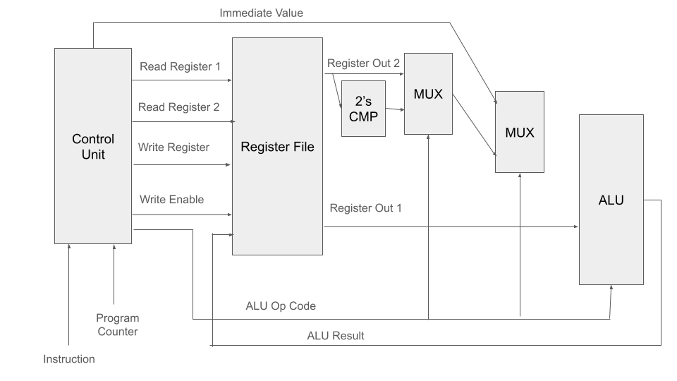

<!---

This file is used to generate your project datasheet. Please fill in the information below and delete any unused
sections.

You can also include images in this folder and reference them in the markdown. Each image must be less than
512 kb in size, and the combined size of all images must be less than 1 MB.
-->

## How it works

This model is loosely based off of the MIPS archetecture. First, the program counter is advanced and an instruction is loaded into the main control unit. Next, the register file loaded in, using data from the instruction to point to different registers. The op code is then used to determine the outputs of two multiplexers and select a function for the arithmetic logic unit. The result of the ALU can then be read by the user.

## How to test

Write an instruction that you would know the output of, then feed the instruction into the CPU and wait for the result. 

## External hardware

List external hardware used in your project (e.g. PMOD, LED display, etc), if any
